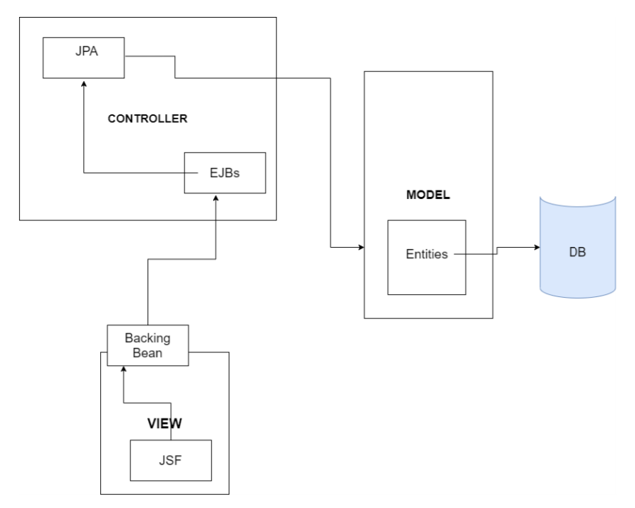

# Java payment system
Web app, created using Java EE, JSF, EJBs. 

Implements MVC architecture. The model, made up of the EJBs along with the
entity classes used to interact with the database, was used to perform business
logic. JPA was used to interact with the underlying database via the entity
classes and beans. The view was implemented using JSF, separating the user
interface allowed the control to be executed via the backing bean

## System Diagram

## Applied technique assessment
Authentication occurs when logging in, checking against registered users in the
DB via JDBC pool + data source. JPA enabled querying of the database. User
roles were implemented, but without the proper Java EE technique of security
roles. The security and roles were implemented using the DB and beans /
entities. All database queries were properly constructed using the Persistence
Query Language’s typed queries, as to avoid any chances of SQL injection.
Passwords are hashed and only ever compared after being hashed as to avoid
any unwanted plaintext storage.

## Extending design to ensure server isn't a SPOF
Including caching, using Hibernate, would be an immense source of availability,
as it would enable speedy data retrieval - lessening the strain on the network when
requests are executed.
Distributing the load via clustering would greatly reduce the likelihood of single point of
failure, by ensuring protection from failures, providing easier scalability and load
balancing.

## How the system deals with concurrent access
The project implements Java EE’s technique for transactions, where all actions
must complete or else the whole transaction gets rolled back. Injecting a
UserTransaction object provides an interface so that apps are able to start,
commit and/or roll back transactions, avoiding the inconsistent retrieval problem.

